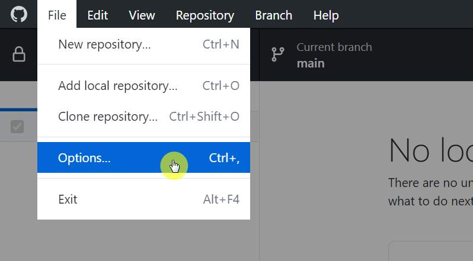

## ✔️ Preparing to create a new site

Instal Hugo Extended last version as stated here: [Hugo Docs](https://gohugo.io/getting-started/installing/).

Below I describe my version of this process **for Windows 10 users**.

1. Go to the Hugo releases page: [GitHub](https://github.com/gohugoio/hugo/releases).
2. Find and download the latest release of **Hugo Extended** for your operating system, the 32-bit or 64-bit file depending on whether you have 32-bit or 64-bit Windows.
3. Move the dowloaded ZIP file into your Hugo bin folder: `C:\Hugo\bin` and extract it into the current folder. Now you're supposed to have three new files here: `hugo` (executable), `LICENSE`, `README`.

4. Add Hugo to your Windows PATH settings:
    - Right click on the Start button.
    - Click on System.
    - Click on Advanced System Settings on the left.
    - Click on the Environment Variables… button on the bottom.
    - In the User variables section, find the row that starts with PATH (PATH will be all caps).
    - Double-click on PATH.
    - Click the New… button.
    - Type in the folder where `hugo.exe` was extracted, which is `C:\Hugo\bin` if you went by the instructions above. The PATH entry should be the folder where Hugo lives and not the binary. Press Enter when you’re done typing.
    - Click OK at every window to exit.

👍 So, all the preliminary preparations are done.

## 💡 Now you will create a new Hugo site

Run [VS Code](https://code.visualstudio.com/) app. In Terminal tab write: `hugo new site hugo-test` . Words "hugo-test" you can replace with your own site name.

Further click "Enter".

✨🎓 Get your congratulations 😊👍:

Your new Hugo site was created in a moment!

## ➕ Create new GitHub repository for existing Hugo site local folder

1. Run [GitHub Desktop](https://desktop.github.com/) app, click "File"->"Option" and connect to you GitHub account.

2. On the top left corner, click "File"->"Add local repository"

3. In modal dialog set "Local path" to your new Hugo site folder by clicking "Choose..." button. Then click to link "create a repository" (don't click "Add repository" button).

4. In the next dialog "Create a new repository" click "Initialize new repository with README" and then click "Create repositiry" button.

5. Publish new repository to GitHub by clicking on "Publish repository" button.

6. Here the next dialog windows. Write "Description" of your new GitHub repository in the corresponding text field and click "Publish repository" button.

7. Now make sure everything is done correctly. In the GitHub Desktop application click "View on GitGub" button.

8. ✨ Your new repository on githab is created! 👍

