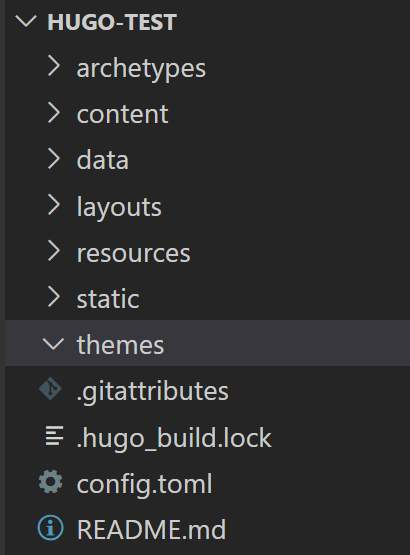
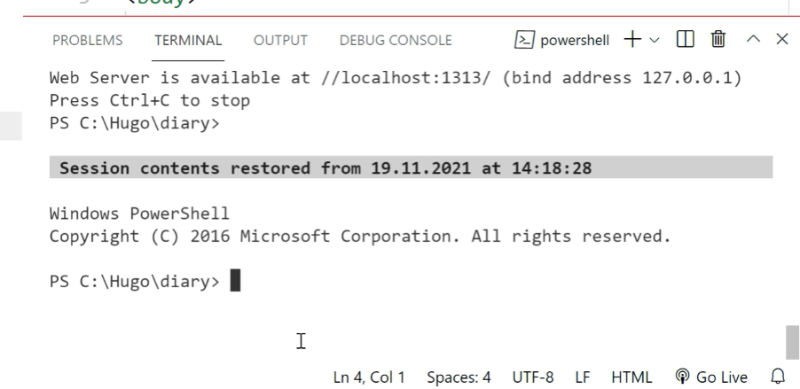

## Pre-requisites

**_NOTE:_** If you are new to Hugo or web design in general, it's a good idea to start with a working site. You will definitely break things during experiments.

To create a new Hugo theme from scratch you must have:

1. Installed Hugo on the local machine.
2. Your own working Hugo test site.

If it is not, you need [install Hugo and create a new Hugo site](/posts/create-new-hugo-site/).

## Get started

### 1. Theme folder in Hugo structure

So, your Hugo site has the following basic folder structure:


### 2. Set theme folder in Termilal

In the Terminal tab go into your Hugo test site folder: `cd test-site` If you need to go up in the folder tree you can use the command `cd ..`.

### 3. Create a new theme

Now create a new theme with a name you like. In Your Terminal tab write the command: `hugo new theme my-theme`.


### 4. Download Bootstrap 5 SASS source

We will create new theme with Hugo Pipes SASS/SCSS recomendations - [GoHugo](https://gohugo.io/hugo-pipes/scss-sass/).

Download full set of Bootstrap 5 Source files (on Bootstrap Download page [GetBootstrap](https://getbootstrap.com/docs/5.1/getting-started/download/) click `Download source` button) and unzip it.

### 5. Insert Bootstrap5 stylesheets in your theme

In `my-theme` folder create a new directory named `assets`.

Open the unzipped Bootstrap package with Windows File Explorer, find the `scss` folder and rename it into `bootstrap`.

```text
|_ bootstrap-5.1.3
   |_ ...
   |_ scss <= rename this folder to "bootstrap"
   |_ ...
```

Then copy the `bootstrap` folder with Windows File Explorer and paste it in your theme `assets` folder in your Hugo site:

```text
|_ hugo-test
   |_ ...
   |_ my-theme
      |_ ...
      |_ assets <= insert here
         |_ bootstrap
```

### 6. Create a custom stylesheet

Create `my-theme.scss` file in `themes/my-theme/assets/` directory.

```text
|_ hugo-test
   |_ ...
   |_ my-theme
      |_ ...
      |_ assets
         |_ bootstrap
         |_ my-theme.scss <= create this
```

### 7. Include stylesheet in head of the page

Now include your new stylesheet and put other meta tags in head of the page.

Open the file `themes/mytheme/layouts/partials/head.html` and paste this code:

```html

<head>
   <meta charset="UTF-8">
   <meta http-equiv="X-UA-Compatible" content="IE=edge">
   <meta name="viewport" content="width=device-width, initial-scale=1.0">
   <link rel="canonical" href="{{ .Permalink }}">

   <!-- Load page title -->

   {{ $title := print .Title " | " .Site.Title }}
      {{ if .IsHome }}{{ $title = .Site.Title }}{{ end }}
   <title>{{ $title }}</title>

   <!-- Load stylesheets -->

   {{ $style := resources.Get "my-theme.scss" | toCSS | minify }}
   <link rel="stylesheet" href="{{ $style.Permalink }}">

</head>

```

Then save it.

### 8. Add favicon

Place the favicon file inside the `static` folder. The `static` folder is located in the root of your Hugo website - `hugo-test/static/`. During the generation of your website, the favicon will be copied to . public, the root of the generated site.

For test tasks, you can put the favicon in `themes/my-theme/static/` directory.

### 9. Create footer and add javascript

Open `themes/my-theme/layouts/partials/footer.html` and insert the following code:

```html

<footer class="footer fixed-bottom bg-dark">

   <div class="row footer-text">
     <div class="col-12 col-md text-center text-md-left nav-link text-white">Copyright (c) {{ now.Format "2006"}} John Doe. All rights reserved.</div>
   </div>

 <!-- JavaScripts -->

 {{ $bootstrapjs := resources.Get "js/bootstrap.bundle.min.js" | resources.Minify }}
 <script defer language="javascript" type="text/javascript" src="{{ $bootstrapjs.RelPermalink }}"></script>

</footer>

```

### 10. Start Hugo server on localhost

Run `hugo server` command in Terminal. It starts Hugo server to view your website on localhost.

