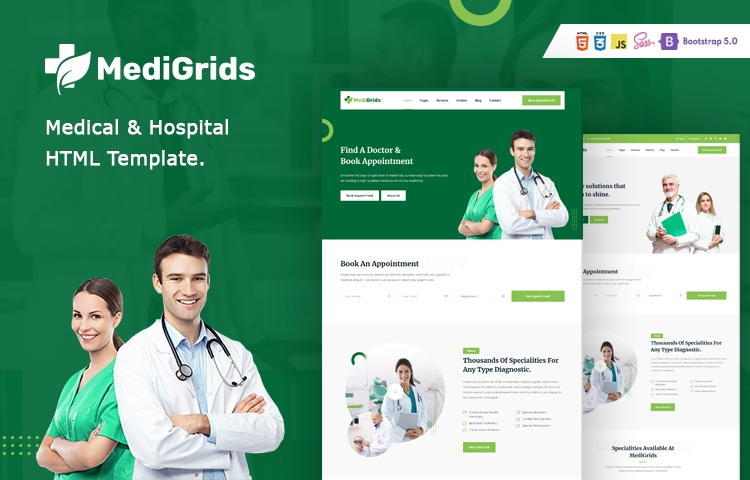

+++
title = "20+ Best Free Bootstrap 5 Templates November 2021"
date = "2021-11-11T20:33:55+02:00"
author = ""
authorTwitter = "" #do not include @
cover = ""
tags = ["Bootstrap", "Free Templates", "Web Design"]
keywords = ["", ""]
description = ""
showFullContent = false
+++

## Medic

Medic is a free website Bootstrap 5 template for doctors, clinics and hospitals based on HTML5 and Bootstrap5. It comes with a fresh and clean design and all the essential sections and functionality you need to set up a comprehensive website for the clinic or hospital. It features - impressive slider, about section to tell introduce about your clinic, services section to explain specializations, testimonial scrollbar, doctor grids with designations, subscription form, social links, emergency help sections and last but not the least a fully working doctor appointment form.

[🔍 Preview](https://preview.uideck.com/items/medic/index.html)  [📥 Download](https://uideck.com/templates/medic/)

## Appify

Appify is an free app landing page template. It comes with a clean, high-quality design and all the essential elements/sections you need to create a complete web site application or advanced landing pages. This template is based on Bootstrap5 & HTML and easy to customize according to the needs of your project.

[🔍 Preview](https://preview.uideck.com/items/appify/index.html)  [📥 Download](https://uideck.com/templates/appify/)

## Alif

Alif is a free and high-end Bootstrap 5 template for businesses and start-ups. It is an ideal starting point for any company or start-up. Alif is delivered with a modern and clean design, which also includes many beautiful icons! Using Alif, you can create any type of website without coding.

[🔍 Preview](https://demo.graygrids.com/themes/alif/)  [📥 Download](https://graygrids.com/templates/alif-free-bootstrap-5-business-template/)

## MediGrids

MediGrids is a free, premium HTML template especially designed for medical, hospital, medical and similar websites. This medical portal template is constructed with HTML and Bootstrap 5.0 which is trending at the moment. In addition, MediGrids comes with a clean, high quality, fresh and modern design for your next medical portal project. This Bootstrap 5 template offers over 100 user interface components and over 30 pages for the design of a complete medical website.

[🔍 Preview](https://demo.graygrids.com/themes/medigrids/index.html)  [📥 Download](https://graygrids.com/templates/medigrids-free-medical-and-hospital-html-template/)

## Mediplus

Mediplus is a free and top quality medical HTML template with a clean and modern design. Good look and powerful features make Mediplus attractive. It can be used for any type of health-related Web site, such as the Doctor's Clinic, Hospital, Doctor's Consultation Centre, Cosmetic Surgery Centre, Medical Laboratory, Dental Clinic, Centennial Clinic, Pharmacy, etc.

[🔍 Preview](https://wpthemesgrid.com/themes/mediplus/)  [📥 Download](https://wpthemesgrid.com/downloads/mediplus-medical-and-doctor-html-template/)

## Simple

Simple is a free, clean and super simple company site template built with the latest Bootstrap 5. It is free to download and use and comes with essential elements, such as – awesome hero area, services, features, team, gallery and fully functional contact form. This template has been carefully designed using the features of Bootstrap 5 so that you can use it as a starting point for your creative development process. If you are looking for a free Bootstrap5 template with simple user interface elements, adaptive layout, and with all the essential features for the SIMPLE corporate web site is perfect for you.

[🔍 Preview](https://preview.uideck.com/items/simple/index.html)  [📥 Download](https://graygrids.com/templates/free-bootstrap-5-template-simple/)

## Agency

Agency is a free elegant Bootstrap 5 site template. It is specially designed for agencies and small companies looking for an attractive home page. Built with HTML5 and CSS3 the web template got all the measurements to make an awesome online presence. It is 100% responsive, highly optimized, and runs smoothly on any existing browsers. In addition, it comes with several top-of-the-range features like a hero header, fixed top navigation bar, call-to-action button, contact form, portfolio grid gallery, social media links, and more. Its code is well structured, allowing everyone to customize it without problems. If you want to make an initial impression strong and durable, Agency is the best template for you.

[🔍 Preview](https://technext.github.io/agency-2/)  [📥 Download](https://themewagon.com/themes/free-bootstrap-5-html-5-business-website-template-agency/)

## Bliss

Bliss is a simple corporate website template which is designed for a digital agency, business and similar websites. It comes with a clean design with all the essential sections and elements you need to create a complete agency or corporate website.

[🔍 Preview](https://preview.uideck.com/items/bliss/index.html)  [📥 Download](https://uideck.com/templates/bliss/)

---

## 🔗 Useful resources

Useful resources for those looking for free Bootstrap 5 HTML templates and UI components:

- [UIdeck](https://uideck.com/) - HTML Landing Page Templates and UI Kits

- [Ayro UI](https://ayroui.com/components) - UI Components, Snippets and Blocks for Bootstrap

- [eCommerce HTML](https://ecommercehtml.com/) - eCommerce HTML UI Kit and Templates

- [GrayGrids](https://graygrids.com/templates/category/free-html-templates/) - Free HTML Templates Comes that you need to create a simple site and launch your quick MVP.
